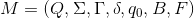

  
  
# PTC (Fall 2018) — Project
  
  
  
  
  
  
* [PTC (Fall 2018) — Project](#ptc-fall-2018-project )
	* [1. 任务描述](#1-任务描述 )
		* [任务一：图灵机程序解析器](#任务一图灵机程序解析器 )
		* [任务二：图灵机模拟器](#任务二图灵机模拟器 )
		* [任务三：图灵机程序](#任务三图灵机程序 )
		* [其他](#其他 )
	* [2. 图灵机程序语法](#2-图灵机程序语法 )
		* [基本语法](#基本语法 )
		* [进阶语法](#进阶语法 )
			* [通配符](#通配符 )
			* [说明](#说明 )
		* [示例](#示例 )
	* [3. 测试和验收](#3-测试和验收 )
	* [4. 提交说明](#4-提交说明 )
		* [提交格式](#提交格式 )
		* [提交地址](#提交地址 )
		* [截止日期](#截止日期 )
  
  
  
  
## 1. 任务描述
  
本项目的总体目标是要实现一个**标准 (确定性、双向无限纸带) 图灵机**的模拟器，并且能够在上面正确模拟运行符合特定语法的图灵机程序。
  
### 任务一：图灵机程序解析器
  
参考下文 ***[Section 2](#2-图灵机程序语法 )*** 中的图灵机程序语法，实现一个**标准图灵机程序解析器**。要求：
1. 以符合语法描述的图灵机程序作为解析器的输入；
2. 该解析器能够正确解析读入的图灵机程序；
3. 图灵机程序解析完成后，得到与之对应的一个**图灵机模拟器** (见**任务二**)。
  
### 任务二：图灵机模拟器
  
图灵机程序经过解析器解析后，得到一个对应的**标准图灵机模拟器**。模拟器读入一个字符串作为图灵机的输入。要求：
1. 判断输入字符串的合法性 (也即判断所有字符是否均属于**输入符号集**，输入符号集的定义参见 **[语法描述](#基本语法 )**)。若字符串不合法，则不对其进行模拟运行，并按以下格式报告输入错误：
    ```
    Input: XXXXXXXXXXXX
    ==================== ERR ====================
    The input "XXXXXXXXXXXX" is illegal
    ==================== END ====================
    ```
    若字符串合法，按以下格式输出提示信息，并转 2：
    ```
    Input: XXXXXXXXXXXX
    ==================== RUN ====================
    ```
2. 模拟器对合法的输入串进行模拟运行。对于图灵机上的每一次转移，按以下格式给出图灵机的一个瞬时描述：
    ```
    Step  : 0
    Index : 0 1 2 3 4 5 6
    Tape  : 1 0 0 1 0 0 1
    Head  : ^
    State : 0
    ---------------------------------------------
    Step  : 1
    Index : 0 1 2 3 4 5 6
    Tape  :   0 0 1 0 0 1
    Head  :   ^
    State : li
    ---------------------------------------------
    Step  : 2
    Index : 0 1 2 3 4 5 6
    Tape  :   0 0 1 0 0 1
    Head  :     ^
    State : li
    ---------------------------------------------
    ......
    ......
    ......
    ---------------------------------------------
    Step  : 40
    Index : 0 1 2 3 4 5 6
    Tape  :       T r u e
    Head  :             ^
    State : halt_accept
    ---------------------------------------------
    ```
    > *注 1*：`Index` 中的 `0` 表示初始时纸带上包含输入的最左单元的索引位置；
    > 
    > *注 2*：读写头初始位置为初始输入的最左单元位置；
    >
    > *注 3*：图灵机程序中用于表示空格符号的 `'_'` 在纸带上不用显式输出，输出空格 `' '` 即可；
    >
    > *注 4*：`Index` 中相邻两项之间以一个空格为间隔，`Tape` 上的符号与 `Index` 中对应的索引靠左对齐，示例：
    >  ```
    >  Step  : 19
    >  Index : 0 1 2 3 4 5 6 7 8 9 10 11 12
    >  Tape  : 1 1 1 0 0 0 0 0 1 1 1  0  0
    >  Head  :             ^
    >  State : s2
    >  ```
    >
    > *注 5*：若需要向 `0` 索引左边的纸带单元中读写字符，请在 `Index` 中按照 `"... 3 2 1 0 1 2 3 ..."` 的格式 (即省略 `-3 -2 -1` 等负索引的负号) 对索引进行描述。 
3. 模拟运行结束后，将纸带上的内容 (有限长度，首尾分别为纸带上第一个和最后一个非空格符号) 作为最后的输出。并输出以下信息：
    ```
    Result: XXXX
    ==================== END ====================
    ```
    其中 `XXXX` 为模拟运行结束后纸带上的内容。
  
  
### 任务三：图灵机程序
  
使用下文 ***[Section 2](#2-图灵机程序语法 )*** 中描述的图灵机程序语法，实现 ***[Assignment 3 - Problem 2](http://cs.nju.edu.cn/bulei/PTC18/18-3.pdf)*** 中的图灵机对应的图灵机程序。要求：
1. 将该图灵机实现为一个判定器，即判定一个输入串是否在该图灵机描述的语言中；
2. 使用你在**任务一**中实现的图灵机程序解析器对上述图灵机程序进行解析，得到对应的**图灵机模拟器**实例；
3. 使用模拟器对合法的输入字符串进行模拟运行。对于符合图灵机语言要求的字符串，在纸带上打印 `True`；对于不符合图灵机语言要求的字符串，在纸带上打印 `False`。要求在图灵机停止运行时，纸带上不出现 `True` 和 `False` 外的其他内容。
  
### 其他
  
编程语言：`Java 8`，推荐使用 [IntelliJ IDEA](https://www.jetbrains.com/idea/ )
  
## 2. 图灵机程序语法
  
图灵机的形式化描述如下：
<p align="center"></p>  
  
  
下面定义的图灵机程序语法完整地刻画了上述七部分内容。
  
### 基本语法
  
1. **状态集 **。以 `#Q` 开头。**占据 (且仅占据) 图灵机程序的一行，即不包括回车换行，`'#'` 为该行的第一个字符** (以下2，3，4，5，6同)。各状态之间以英文逗号 `','` 分隔。状态用一个或多个**非空白字符** (字母`a-z,A-Z`、数字`0-9`和下划线`_`) 表示，称为该状态的**标签**，如 `"10"`、`"a"`、`"state1"` 等。语法格式为 `#Q = {q1,q2,...,qi}`。**`'='` 两边各有一个空格`' '`** (以下2，3，4，5，6同)</u>。示例：
    ```
    #Q = {0,1o,1i,2o,2i,3,4,accept,accept2,accept3,accept4,halt_accept,reject,reject2,reject3,reject4,reject5,halt_reject}
    ```
  
2. **输入符号集 **。以 `#S` 开头。各符号之间以英文逗号 `','` 分隔。输入符号的可取值范围为除 `' '(space)`、`','`、`';'`、`'*'`、`'_'` 外的所有 **ASCII 可显示字符** (定义参考 [维基百科](https://zh.wikipedia.org/wiki/ASCII ))。语法格式为 `#S = {s1,s2,...,sj}`。示例：
    ```
    #S = {0,1}
    ```
  
3. **纸带符号集 **。以 `#T` 开头。各符号之间以英文逗号 `','` 分隔。纸带符号的可取值范围为除 `' '(space)`、`','`、`';'`、`'*'` 外的所有 **ASCII 可显示字符**，规定用 `'_'` 表示空格符号。语法格式为 `#T = {t1,t2,...,tk}`。示例：
    ```
    #T = {0,1,_,T,r,u,e,F,a,l,s}
    ```
  
4. **初始状态 **。以 `#q0` 开头。语法格式为 `#q0 = q`。示例：
    ```
    #q0 = 0
    ```
  
5. **空格符号 **。以 `#B` 开头。语法格式为 `#B = b`。在本项目中，空格符号规定为 `'_'`。示例：
    ```
    #B = _
    ```
  
6. **终结状态集 **。以 `#F` 开头。各状态之间以英文逗号 `','` 分隔。语法格式为 `#F = {f1,f2,...,fn}`。示例：
    ```
    #F = {halt_accept,halt_reject}
    ```
  
7. **转移函数**：
    - 每个转移函数占用 (且仅占用) 图灵机程序的一行，行内容为一个五元组。五元组格式为："旧状态 旧符号 新符号 方向 新状态"，元组各部分之间以一个空格分隔。
        - (新、旧) 状态定义见 **状态集 **。
        - (新、旧) 符号定义见 **纸带符号集 **。
        - 方向为以下三个符号之一：`'l'`、`'r'` 或者 `'*'`，分别表示向左移动、向右移动和不移动。
    - 示例：
    ```
    0 0 _ r 1o ; 当前处于状态0，带头下符号为'0'，将要写入的新符号为'_'，下一步向右移动，下一个状态为1o
    ```
  
8. **注释**。只需处理行注释。行注释以英文分号 `';'` 开头，在解析程序时应当忽略注释。示例：
    ```
    ; State 0: read the leftmost symbol
    0 _ _ * accept     ; Empty input
    ```
  
### 进阶语法
  
#### 通配符
  
1. 通配符 `'*'` 用于表示旧符号时，可匹配任意符号。示例：
    ```
    reject * _ l reject ; 表示无论当前读写头读到什么符号，都在纸带单元中写入空格符号，并向左移动
    ```
  
2. 通配符 `'*'` 用于表示新符号时，表示没有变化。示例：
    ```
    1o * * r 1o ; 表示无论当前读写头读到什么符号，都不改变符号，并向右移动
    ```
  
#### 说明
  
通配符 `'*'` 的使用可能会**破坏标准图灵机的“确定性”**，示例：
```
1o _ _ l 2o
1o * * r 1o
```
在当前状态为 `1o` ，读写头下单元中为空格字符时，可以同时匹配上述两个转移函数。因此我们规定：
> 当可以同时匹配多个转移函数时，匹配更精确的转移函数。
  
也即对于上述示例，我们会匹配第一个转移函数 `1o _ _ l 2o`。
  
### 示例
  
完整的图灵机程序示例请参见 [`palindrome_detector.tm`](./examples/palindrome_detector.tm )。
  
## 3. 测试和验收
  
1. **任务一** & **任务二**。我们会使用另外准备的图灵机程序以及对应的输入来对你实现的图灵机解析器和模拟器的正确性进行测试。每个图灵机程序的测试方案同下述 **任务三** 的测试方案。
2. **任务三** 测试方案：
    - 输入为两个文件。第一个文件为你实现的图灵机程序文件 `xxx.tm`，第二个为测试文件 `input.txt`。测试文件中每一行包含一个用于测试的输入字符串。实现时测试文件请自备，助教验收代码时会准备另外的测试文件。
    - 输出也为两个文件。第一个文件是运行时信息输出文件 `console.txt`，具体输出要求见 **[任务二](#任务二图灵机模拟器 )**。第二个文件为结果文件 `result.txt`。结果文件中的每一行对应着输入文件中的每一行输入字符串对应的输出结果。对于**任务三**中的图灵机程序，当输入字符串在该图灵机描述的语言中时，在文件中输出一行 `True`，否则在文件中输出一行 `False`。
3. 为方便我们进行测试，请将你的 `Java` 项目打包为一个可执行 `jar` 包，命名为 `turing.jar`，并确保能够正确运行以下命令：
    ```
    java -jar turing.jar xxx.tm input.txt
    ```
    该命令运行后，会在当前路径上生成两个文件 `console.txt` 和 `result.txt`。

## 4. 提交说明
  
**重要声明：为维护学术诚信，我们将对所有提交代码进行查重。请各位同学务必独立完成本项目。**
  
### 提交格式
  
1. 实验源代码。请提交完整项目工程代码。
2. 可执行 `jar` 包。
3. 图灵机程序文件。分别命名为 `1.tm`、`2.tm`。
4. 报告。报告格式为 `pdf`，文件名为 `学号+'-'+姓名`。报告内容包括分析与设计思路、实验完成度、实验中遇到的问题及解决方案、演示和总结感想，以及其他任何想写的内容 (如对课程和项目的意见与建议等)。
5. 请将上述两部分内容打包为一个 `zip` 文件进行提交，文件名为 `学号+'-'+姓名`。文档结构示例如下：
    ```
    161220XXX-张三.zip (MG1833XXX-李四.zip)
        |
        --- 1.tm
        |
        --- 2.tm
        |
        --- turing.jar
        |
        --- 161220XXX-张三.pdf (MG1833XXX-李四.pdf)
        |
        --- your-project
    ```
  
### 提交地址
  
请登录 [南京大学计算机系本科教学支撑平台](http://cslabcms.nju.edu.cn )，在本课程项目的对应作业提交位置进行提交。
> *注 1*：支撑平台的初始账号和默认密码均为学号 (已使用过支撑平台的同学自动忽略本条说明)；
>
> *注 2*：研究生同学可以按相同方式登录该平台 (忽略**本科**教学支撑平台)。
  
### 截止日期
  
2018-12-27 23:59:59
  